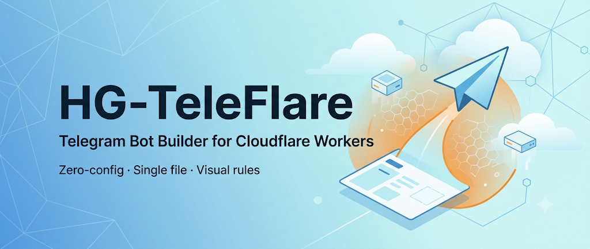
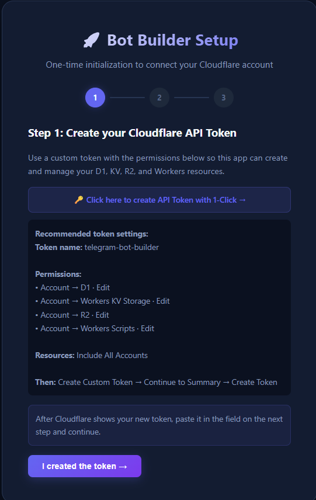
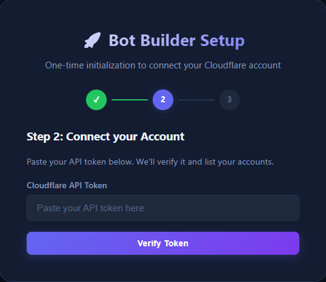
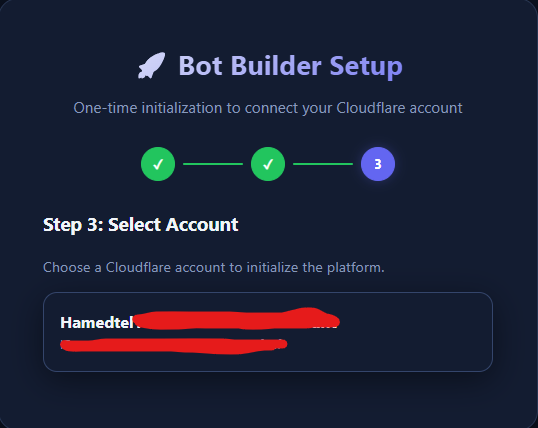
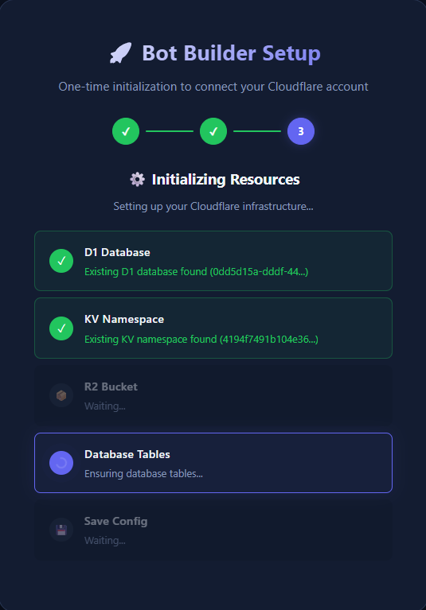
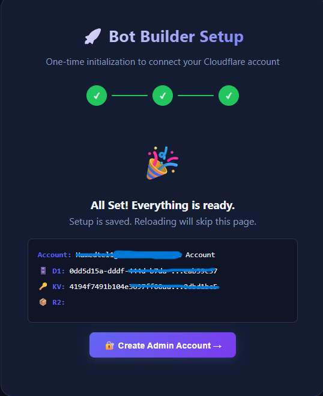
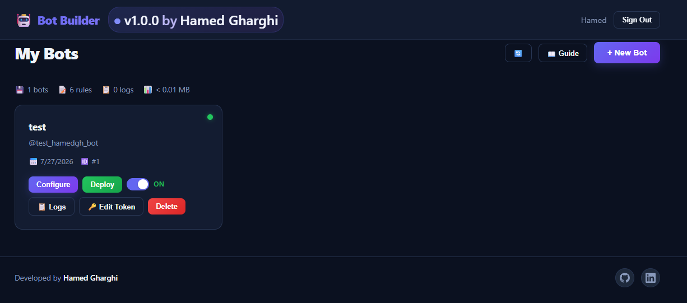
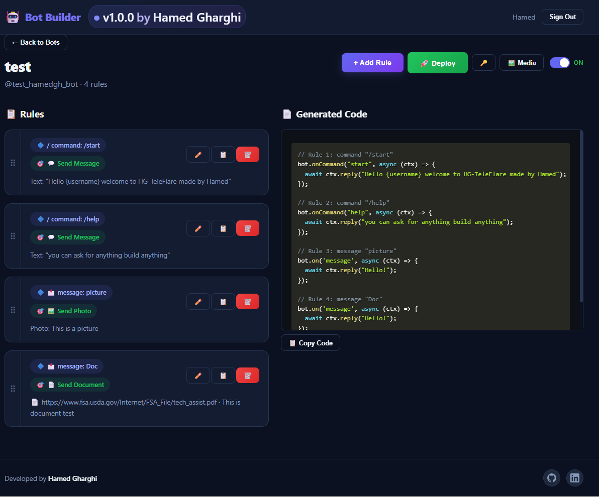
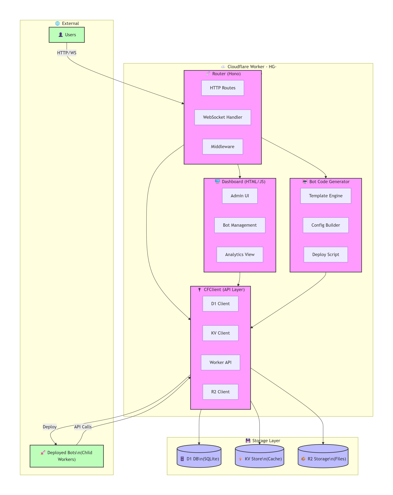

<div align="center">
  
  <br/>
  <h1>HG-TeleFlare</h1>
  <h3><em>The Zero-Config, Self-Bootstrapping Telegram Bot Builder for Cloudflare Workers</em></h3>
  <br/>
  <p align="center">
    <a href="#-features"><strong>✨ Features</strong></a> ·
    <a href="#-whats-new-in-v130"><strong>🆕 v1.3.0</strong></a> ·
    <a href="#-quick-start-deploy-in-60-seconds"><strong>🚀 Quick Start</strong></a> ·
    <a href="#-full-deployment-guide-step-by-step"><strong>📖 Full Guide</strong></a> ·
    <a href="#-architecture"><strong>🏗️ Architecture</strong></a> ·
    <a href="#-security"><strong>🔒 Security</strong></a> ·
    <a href="#-api-reference"><strong>📖 API</strong></a>
  </p>
  <br/>

  [](https://opensource.org/licenses/MIT)
  []()
  [](https://workers.cloudflare.com/)
  []()
  [](https://dash.cloudflare.com/)
  []()
  []()

  <br/>

  **HG-TeleFlare** is a complete, self-contained **micro-SaaS in a single file**. Deploy it on Cloudflare Workers, paste your API token once, and it automatically provisions its own infrastructure — D1 database, KV storage, and dynamic bot workers — all through a beautiful visual dashboard. Build, manage, and deploy Telegram bots **without writing any code**.

  <br/>
</div>

---

## 🆕 What's New in v1.3.0

Everything since **v1.0.0** ships in this release (no separate 1.1 / 1.2 tags).

| Area | Improvement |
|---|---|
| **📤 Import / Export** | Download rules as JSON templates; import with append or replace |
| **🎯 Match types** | Message/callback triggers: **Contains**, **Exact**, **Starts With**, **Regex** |
| **🔁 Multi-step forms** | **On State** triggers + **Set / Clear State** actions (KV-backed) |
| **📢 Broadcast** | Newsletter to subscribers — personalized (`{first_name}`, `{username}`, …), KV + live-Worker audience, subrequest-safe sending (~40/request on free plan) |
| **📋 Logs** | KV-first history with aggregated storage so the dashboard shows full activity |
| **👥 Subscribers** | Audience from live bot Worker + KV; Broadcast UI shows D1 / KV / Worker sources |
| **📁 Media picker** | Choosing a library file no longer resets the rule editor |
| **⏳ Loading UX** | Spinners / progress on Logs, Broadcast, Deploy, Save Rule, Sign In / Sign Up, and more |
| **⌨️ Auth** | Enter key submits Sign In / Create Admin forms |
| **📊 Dashboard stats** | Log counts include KV-backed logs (not D1-only zeros) |

> **Upgrade tip:** After pasting `worker.js`, open the dashboard once, then click **🚀 Deploy** on each bot so child workers pick up the new broadcast/subscriber code.

---

## 📋 Table of Contents

- [✨ Features](#-features)
- [🆕 What's New in v1.3.0](#-whats-new-in-v130)
- [🔮 Coming Features (برنامه‌های آینده)](#-coming-features-برنامه‌های-آینده)
- [🚀 Quick Start (Deploy in 60 Seconds)](#-quick-start-deploy-in-60-seconds)
- [📖 Full Deployment Guide (Step-by-Step)](#-full-deployment-guide-step-by-step)
  - [Step 1: Sign Up / Log Into Cloudflare](#step-1-sign-up--log-into-cloudflare)
  - [Step 2: Create a Cloudflare Worker](#step-2-create-a-cloudflare-worker)
  - [Step 3: Open the Worker Editor](#step-3-open-the-worker-editor)
  - [Step 4: Copy the Code from worker.js](#step-4-copy-the-code-from-workerjs)
  - [Step 5: Paste the Code into the Cloudflare Editor](#step-5-paste-the-code-into-the-cloudflare-editor)
  - [Step 6: Save and Deploy](#step-6-save-and-deploy)
  - [Step 7: Create a Cloudflare API Token](#step-7-create-a-cloudflare-api-token)
  - [Step 8: Complete the Setup Wizard](#step-8-complete-the-setup-wizard)
  - [Step 9: Register Your Admin Account](#step-9-register-your-admin-account)
  - [Step 10: Start Building Bots!](#step-10-start-building-bots)
- [📸 Screenshots](#-screenshots)
- [🏗️ Architecture](#️-architecture)
- [📖 API Reference](#-api-reference)
- [🔒 Security](#-security)
- [⚠️ Known Limitations](#️-known-limitations)
- [🌐 Bilingual Support (English / فارسی)](#-bilingual-support-english--فارسی)
- [🤝 Contributing](#-contributing)
- [📄 License](#-license)
- [📝 Changelog](#-changelog)
- [📬 Contact](#-contact)

---

## ✨ Features

| Feature | Description |
|---|---|
| **🤖 Zero-Config Self-Bootstrapping** | Paste a Cloudflare API token, and HG-TeleFlare automatically creates its own **D1 Database** & **KV Storage**, runs schema migrations, and saves the config — no CLI, no manual setup. |
| **🎨 Visual Rule Builder** | Create bots using an intuitive drag-and-drop UI. Map **Triggers** (Commands, Messages, Callbacks, New Members, **On State**) to **Actions** (Send Message, Send Photo/Document, Keyboards, Fetch APIs, Store Data, Set/Clear State). |
| **⚡ Dynamic Worker Generation** | Click **"Deploy"** and HG-TeleFlare translates your visual rules into optimized, pure-JavaScript code, provisions a child Cloudflare Worker, and sets up the Telegram webhook — **instantly**. |
| **📁 Built-in Media Storage** | Upload images and documents in the dashboard (KV, up to 15MB). Pick files from the library when building Send Photo / Send Document rules. |
| **🔤 Dynamic Variables** | Personalize replies **and broadcasts** with `{first_name}`, `{username}`, `{last_name}`, `{user_id}`, `{chat_id}`, `{message}`, `{date}`. |
| **📊 Real-Time Log Viewer** | Monitor bot activity (D1 + KV), filter by level (DEBUG / INFO / WARNING / ERROR), and clear logs on demand. |
| **📦 Single-File Deployment** | The entire app — router, API client, dashboard UI, code generator — lives in one `worker.js`. No build step, no npm at runtime. |
| **🔄 Rule Reordering** | Drag and drop to reorder rules. Priority is managed automatically. |
| **📋 Rule Duplication** | Clone existing rules to speed up configuration. |
| **📤 Import / Export Templates** | Download a bot's rules as JSON, or import a shared template (append or replace). |
| **🎯 Advanced Trigger Matching** | Message/callback rules support **Contains**, **Exact**, **Starts With**, and **Regex**. |
| **📢 Broadcast / Newsletter** | Send personalized messages to everyone who has messaged your bot (auto-tracked via KV + live Worker). |
| **🔁 Multi-Step Forms** | **On State** triggers + **Set/Clear State** actions for conversational flows (KV-backed). |
| **⏳ Loading Feedback** | Buttons and pages show progress while slow actions run (deploy, logs, broadcast, save rule, auth). |
| **🔐 JWT Authentication** | Secure admin dashboard with JWT auth. First registration creates the only admin. Sign In / Sign Up support **Enter** to submit. |
| **🌐 Bilingual Meta Tags** | Built-in SEO support for **English** and **Persian (Farsi)**. |

---

## 🔮 Coming Features (برنامه‌های آینده)

> 🌟 **Full Persian (Farsi) Dashboard UI — Coming Soon!**
>
> We're working on a **fully translated Persian dashboard** so Iranian developers can use HG-TeleFlare entirely in their native language. Stay tuned! ❤️

| Feature | Status |
|---|---|
| **🇮🇷 Full Persian Dashboard UI** — Complete RTL interface with Persian translations | 🔜 Planned |
| **📱 Telegram Mini App Support** — Turn bots into Telegram Mini Apps | 📋 Planned |
| **🧩 Webhook Integrations** — Google Sheets, Zapier, and more | 📋 Planned |
| **📦 Pre-built Bot Template Library** — One-click templates on Import/Export | 📋 Planned |
| **📊 Advanced Analytics** — Usage trends and richer charts | 📋 Planned |
| **📬 Large-audience Broadcast Queue** — Batched sends beyond Workers free-plan subrequest limits | 📋 Planned |
| **🌍 Multi-language Bot Responses** — Auto-detect user language | 📋 Planned |

---

## 🚀 Quick Start (Deploy in 60 Seconds)

HG-TeleFlare requires **no** `npm install`, **no** Wrangler CLI, and **no** local environment. Everything runs on Cloudflare's edge.

### Step 1: Create a Cloudflare Worker

1. Go to the [Cloudflare Dashboard](https://dash.cloudflare.com/).
2. Navigate to **Workers & Pages** → **Create application** → **Create Worker**.
3. Give it a name (e.g., `bot-builder-dashboard`).
4. Click **"Edit Code"**.

### Step 2: Paste the Code

1. Open [`worker.js`](./worker.js) from this repository.
2. Select all content and copy it (`Ctrl+A` → `Ctrl+C`).
3. In the Cloudflare editor, select all (`Ctrl+A`) and paste (`Ctrl+V`).
4. Click **"Save and Deploy"**.

### Step 3: Complete the Setup Wizard

1. Visit your Worker's URL (e.g., `https://bot-builder-dashboard.your-subdomain.workers.dev`).
2. The **self-bootstrapping wizard** will guide you through:
   - Creating a Cloudflare API Token (needs `workers`, `d1`, `kv_storage` permissions).
   - Selecting your Cloudflare Account.
   - Automatically provisioning D1 database & KV namespace.
3. Register your **admin account** (first registration is the admin).
4. 🎉 **Done!** Start building bots.

> **v1.3 note:** This release is **paste-and-deploy only**. There is no `package.json`, Wrangler project, or local CLI workflow in this repository. Edit `worker.js` and redeploy from the Cloudflare dashboard. After upgrading, **redeploy each bot** from the UI so child workers match the parent.

---

## 📖 Full Deployment Guide (Step-by-Step)

This guide walks you through every single step — from creating a Cloudflare account to deploying your first bot. Follow along even if you've never used Cloudflare before.

---

### Step 1: Sign Up / Log Into Cloudflare

1. Open your browser and go to **[https://dash.cloudflare.com/](https://dash.cloudflare.com/)**.

2. **If you already have an account:** Enter your email and password, then click **"Sign In"**.

3. **If you're new to Cloudflare:**
   - Click **"Create Account"** or **"Sign Up"**.
   - Enter your **email address** and create a **password**.
   - Verify your email by clicking the link sent to your inbox.
   - Complete the onboarding wizard (you can skip adding a domain — we just need Workers).
   - Select the **"Free"** plan — it includes **100,000 Worker requests per day**, which is more than enough.

4. Once logged in, you'll land on the **Cloudflare Dashboard** — this is your control center.

---

### Step 2: Create a Cloudflare Worker

From the dashboard:

1. In the left sidebar, click **"Workers & Pages"**.

2. Click the **"Create application"** button (blue button, top-right).

3. On the next screen, you'll see two options:
   - **"Workers"** — serverless functions (select this).
   - **"Pages"** — full static sites (not this).
   
   Click **"Create Worker"** under the Workers section.

4. You'll now see the **"Create Worker"** form:
   - **Name:** Enter a name for your worker, e.g., `bot-builder-dashboard`.  
     ⚠️ This name becomes part of your URL: `https://bot-builder-dashboard.your-subdomain.workers.dev`.  
     Choose something memorable but unique.
   - Leave the **"HTTP handler"** template selected (it's the default).
   - Click **"Deploy"**.

5. After a few seconds, you'll see a success message: **"Success! Your script is deployed."**

6. Click the **"Edit code"** button to open the built-in code editor.

---

### Step 3: Open the Worker Editor

The Cloudflare **Workers Editor** is a fully online code editor. You'll see:

- A **file tree** on the left showing `worker.js` (the default template).
- A **code editor** in the center with the default template code already loaded.
- A **preview / console** panel at the bottom.
- A **"Save and Deploy"** button at the top.

📝 **Note:** The editor already created a default `worker.js` with a simple "Hello World" script. We're about to replace it with HG-TeleFlare.

---

### Step 4: Copy the Code from worker.js

Now open the `worker.js` file from this repository:

**Option A — Direct download (recommended):**
1. Go to [worker.js on GitHub](https://raw.githubusercontent.com/Hamed-Gharghi/Cloudflare-Telegram-bot-builder/main/worker.js).
2. Right-click → **"Save as..."** to save it to your computer.
3. Open the saved file in any text editor (Notepad, VS Code, etc.).
4. Press `Ctrl+A` (Select All) then `Ctrl+C` (Copy).

**Option B — From your cloned repo:**
```bash
# If you've cloned this repo locally:
cd Cloudflare-Telegram-bot-builder
# Open worker.js in your code editor and copy all content
```

**Option C — Direct copy from this page:**
Scroll up, find the `worker.js` file content, select all, and copy it.

**Option D — Upload directly via Cloudflare editor:**
In the Cloudflare Workers editor, look for the file tree on the left side. Click the **upload icon** (or right-click → **Upload file**) and select the `worker.js` file you downloaded. This replaces the default `worker.js` with our file automatically.

---

### Step 5: Paste or Upload the Code into the Cloudflare Editor

**Option A — Paste (if you copied the text):**
1. Click anywhere inside the code editor.
2. **Select all existing code:** Press `Ctrl+A` (or `Cmd+A` on Mac).
3. **Delete the old code:** Press `Delete` or `Backspace`.
4. **Paste the new code:** Press `Ctrl+V` (or `Cmd+V` on Mac).
5. The editor now contains the full HG-TeleFlare application.

**Option B — Upload (if you saved worker.js to your computer):**
1. In the file tree panel on the left side of the Cloudflare editor, look for the current `worker.js` file.
2. Delete or rename the default `worker.js` (right-click → **Delete** or **Rename**).
3. Click the **Upload** button (usually a cloud icon or a `+` icon) in the file tree.
4. Select your downloaded `worker.js` file from your computer.
5. The file will appear in the file tree with the full HG-TeleFlare code loaded.

**Either way**, you'll see the full application loaded. You should see the file size indicator — it's a single file, no external dependencies needed.

---

### Step 6: Save and Deploy

1. Click the **"Save and Deploy"** button at the top of the editor.

2. Wait for the deployment to complete (usually 5–10 seconds). You'll see:
   ```
   🚀 Deployment complete!
   Your worker has been deployed at:
   https://bot-builder-dashboard.your-subdomain.workers.dev
   ```

3. **Visit your worker URL** — click the link or open a new tab and navigate to it.

4. You should see the **HG-TeleFlare Setup Wizard** page. If you see an error, refresh the page after 30 seconds (new deployments propagate across Cloudflare's edge).

---

### Step 7: Create a Cloudflare API Token

The setup wizard needs a Cloudflare API Token with permissions to create D1 databases, KV namespaces, and Workers. Here's how to create one:

1. **Open a new tab** and go to **[https://dash.cloudflare.com/profile/api-tokens](https://dash.cloudflare.com/profile/api-tokens)**.

2. Click **"Create Token"** (blue button).

3. Under **"Custom token"**, click **"Get started"** (or "Create Custom Token").

4. Configure the token:
   - **Token name:** `HG-TeleFlare Bot Builder` (or any name you like).
   - **Permissions (add these four):**

     | Permission | Item | Access |
     |---|---|---|
     | **Workers** | Workers Scripts | **Edit** |
     | **Workers** | Workers Routes | **Edit** |
     | **D1** | D1 | **Edit** |
     | **Workers KV** | Workers KV Storage | **Edit** |

   - **Account Resources:** Select **"Include"** → your account name → **"All accounts"** (or your specific account).
   - **Client IP Address Filtering:** Leave blank (not needed).
   - **TTL (Time to Live):** Leave as **"No end date"** (or set to a year if you prefer).

5. Click **"Continue to summary"** → review the permissions → click **"Create Token"**.

6. **⚠️ IMPORTANT:** Copy the token immediately!  
   Cloudflare shows it **only once**. It looks like a long string: `abc123def...xyz`.  
   Click the copy icon or select it and press `Ctrl+C`.  
   Save it somewhere safe (a password manager or a temporary text file).

---

### Step 8: Complete the Setup Wizard

Now go back to your Worker URL (the one from Step 6).

1. You'll see the **HG-TeleFlare Setup Wizard** page with a clean UI asking for your Cloudflare credentials.

2. **Step 2.1 — Enter your Cloudflare Account ID:**
   - Your **Account ID** is in the Cloudflare Dashboard URL:  
     `https://dash.cloudflare.com/`**`<your-account-id>`**
   - Or find it on the **Workers & Pages** page — look in the right sidebar under **"Account ID"**.
   - Copy and paste it into the setup wizard.

3. **Step 2.2 — Paste your API Token:**
   - Paste the token you created in Step 7.

4. **Step 2.3 — Select your Account:**
   - The wizard will verify your token and list your Cloudflare accounts.
   - Select your account from the dropdown.

5. Click **"Initialize Platform"**.

6. The wizard will now **automatically**:
   - ✅ Create a **D1 Database** named `telegram-bot-builder-db`
   - ✅ Create a **KV Namespace** named `telegram-bot-builder-session-kv`
   - ✅ Run **database migrations** (create tables: users, bots, rules, media, logs)
   - ✅ **Save the config** to the Worker's secrets (so it persists across reloads)

7. When done, you'll see a green success message: **"Platform is ready!"**

---

### Step 9: Register Your Admin Account

1. After initialization, the wizard will show the **Registration Form**.

2. Fill in your admin credentials:
   - **Username:** Choose a username (e.g., `admin`).
   - **Password:** Must be at least 6 characters.  
     🔐 This is your admin password — choose something strong!

3. Click **"Register"**.

4. You'll be automatically logged in and redirected to the **Dashboard**.

📝 **Note:** Registration is **one-time only**. The first account created is the **admin**. After that, registration is locked for security. Only the admin can log in.

---

### Step 10: Start Building Bots!

You're now inside the **HG-TeleFlare Dashboard**. Here's what to do next:

#### 10.1 — Create a Telegram Bot

1. Open Telegram and search for **[@BotFather](https://t.me/BotFather)**.
2. Send `/newbot` and follow the instructions to create a new bot.
3. **Save the bot token** (looks like `1234567890:ABCdefGHIjklMNOpqrsTUVwxyz`).

#### 10.2 — Add Your Bot to HG-TeleFlare

1. In the dashboard, click **"Create Bot"**.
2. Paste your **bot token** from BotFather.
3. Click **"Verify & Add"**. The system will:
   - Verify the token with Telegram.
   - Save your bot with its name and username.

#### 10.3 — Add Rules to Your Bot

1. Click on your bot in the dashboard.
2. Click **"Add Rule"**.
3. Configure a trigger:
   - **Command:** e.g., `/start`
   - **Message:** e.g., "hello"
   - **Callback:** for inline button clicks
   - **New Member:** when someone joins a group
4. Configure an action:
   - **Send Message:** Reply with text (use `{first_name}`, `{username}`, etc.)
   - **Send Photo / Document:** From your media library
   - **Show Keyboard:** Display custom buttons
   - **Fetch API:** Call an external API and return the response
   - **Store Data:** Save data to KV storage
   - **Set / Clear State:** Drive multi-step conversations
5. Click **"Save Rule"**.

#### 10.4 — Deploy Your Bot

1. Click the **"Deploy"** button.
2. HG-TeleFlare will:
   - Generate optimized JavaScript code from your rules.
   - Create a new Cloudflare Worker for your bot.
   - Set up the Telegram webhook automatically.
3. **Your bot is live!** 🎉 Test it by sending a message on Telegram.

#### 10.5 — Monitor, Broadcast & Upgrade

1. Open the **"Logs"** tab for real-time activity (KV + D1).
2. Use **Broadcast** to message subscribers (personalize with `{first_name}`, etc.).
3. After upgrading `worker.js` on the parent Worker, **Deploy each bot again** so child Workers get the latest runtime.

---

## 📸 Screenshots

### Setup Wizard

| Step | Screenshot | Description |
|------|------------|-------------|
| 1️⃣ |  | Create Cloudflare API token with 1-click permissions |
| 2️⃣ |  | Paste token and verify with Cloudflare API |
| 3️⃣ |  | Choose your Cloudflare account |
| 4️⃣ |  | Auto-provisioning D1, KV, and running migrations |
| 5️⃣ |  | Setup complete — register your admin account |

### Dashboard

| Preview | Description |
|---|---|
|  | Main dashboard with your bots list |
|  | Visual rule builder (trigger + action) |

---

## 🏗️ Architecture

<div align="center">
  
  <p><em>High-level architecture of HG-TeleFlare (Router, Dashboard, Bot Generator, CFClient, and storage/services).</em></p>
</div>

### Data Flow

1. **User** visits the dashboard → **Router** serves SPA HTML.
2. **User** creates rules visually → **Dashboard** sends API requests.
3. **User** clicks "Deploy" → **Bot Code Gen** generates JavaScript code.
4. **CFClient** provisions a new Cloudflare Worker with the bot code.
5. **CFClient** sets up the Telegram webhook → Bot is live!
6. **Bot** receives messages → Processes rules → Sends Telegram API calls.
7. **Bot** writes activity logs and tracks users → Parent stores in **KV** (primary) + **D1** (backup / relational).
8. **Broadcast** → Parent asks the child Worker to resolve the audience and send (keeps parent subrequests low).

### Storage

| Service | Purpose |
|---|---|
| **D1 (SQLite)** | Relational data — Users, Bots, Rules, Media metadata, log backups |
| **KV** | Media files, session state, aggregated logs (`botlogs:{id}`), subscriber keys / maps |
| **Workers** | Parent dashboard + dynamically deployed child bot Workers |

---

## 📖 API Reference

### Authentication

All endpoints except setup, login, register, and media file serving require a `Bearer` JWT token:

```
Authorization: Bearer <jwt-token>
```

### Bot Management

| Method | Endpoint | Description |
|---|---|---|
| `GET` | `/api/bots` | List all bots for authenticated user |
| `POST` | `/api/bots` | Create a new bot (provide `botToken`) |
| `GET` | `/api/bots/:id` | Get bot details with rules |
| `PUT` | `/api/bots/:id` | Update bot token |
| `DELETE` | `/api/bots/:id` | Delete bot and its rules |

### Rule Management

| Method | Endpoint | Description |
|---|---|---|
| `POST` | `/api/bots/:id/rules` | Create a new rule |
| `PUT` | `/api/rules/:id` | Update a rule |
| `DELETE` | `/api/rules/:id` | Delete a rule |
| `POST` | `/api/rules/:id/duplicate` | Duplicate a rule |
| `POST` | `/api/bots/:id/rules/reorder` | Reorder rules (drag-and-drop) |
| `GET` | `/api/bots/:id/export` | Export bot rules as a JSON template |
| `POST` | `/api/bots/:id/import` | Import rules (`{ rules, mode: "append"\|"replace" }`) |
| `GET` | `/api/bots/:id/users` | List tracked Telegram users for a bot |
| `POST` | `/api/bots/:id/users/track` | Internal — child worker registers a user |
| `POST` | `/api/bots/:id/broadcast` | Broadcast text/photo (personalization vars supported; ~40 recipients / request on free plan) |

### Media Management

| Method | Endpoint | Description |
|---|---|---|
| `POST` | `/api/media/upload` | Upload a file (multipart form, max 15MB) |
| `GET` | `/api/bots/:id/media` | List media for a bot |
| `DELETE` | `/api/media/:id` | Delete media (marks affected rules) |
| `PUT` | `/api/media/:id` | Rename media file |
| `GET` | `/api/media/:id/file` | Serve media file |

### Logging

| Method | Endpoint | Description |
|---|---|---|
| `GET` | `/api/bots/:id/logs` | Fetch logs (optional `?level=ERROR&limit=50`) |
| `DELETE` | `/api/bots/:id/logs` | Clear all logs for a bot |
| `GET` | `/api/bots/:id/logs/stats` | Get log statistics |
| `POST` | `/api/logs/:id` | Internal — receive logs from deployed bots |

### Setup & Auth

| Method | Endpoint | Description |
|---|---|---|
| `GET` | `/api/setup/status` | Check if platform is configured |
| `POST` | `/api/setup/init` | Initialize D1, KV, and migrations |
| `POST` | `/api/setup/verify-token` | Verify a Cloudflare API token |
| `POST` | `/api/register` | Register first admin user |
| `POST` | `/api/login` | Login with credentials |

---

## 🔒 Security

- **API Token Storage:** Cloudflare API tokens are stored in Worker secrets (`PLATFORM_CONFIG`), never exposed to clients after initial setup.
- **Password Hashing:** Passwords are hashed with SHA-256 + salt before storage.
- **JWT Authentication:** Dashboard sessions use signed JWTs with 7-day expiry.
- **JWT Secret:** Set a Worker secret named `JWT_SECRET` to a long random value. If you skip this, the app falls back to a built-in default — fine for quick testing, **not** for a public deployment.
- **Auto-Lock:** Admin registration locks after the first user is created — no unauthorized signups.
- **Bot Verification:** Log ingestion endpoints verify the sender's bot token before accepting data.
- **Media Access:** `/api/media/:id/file` is **intentionally public**. Telegram (and browsers) must fetch image/file URLs without a dashboard login. Treat media URLs as unguessable-but-public links; do not upload confidential documents.

See [SECURITY.md](./SECURITY.md) for known limitations and how to report issues.

### Set `JWT_SECRET` (recommended)

1. Cloudflare Dashboard → your Worker → **Settings** → **Variables and Secrets**.
2. Add a secret: name `JWT_SECRET`, value = a long random string.
3. Save / redeploy if prompted.

---

## ⚠️ Known Limitations

| Limitation | Details |
|---|---|
| **Single admin** | Only the first registered user exists; registration locks afterward. |
| **No password reset** | If you lose admin credentials, you must recover via D1 / redeploy. |
| **Media size** | Max **15MB** per file (KV + Base64 overhead). |
| **Broadcast batch size** | Free-plan Workers have a low **subrequest** budget. Broadcasts send up to **~40 recipients per request**; larger audiences need multiple sends or a future queue. |
| **KV eventual consistency** | Fresh logs / subscribers can lag a few seconds after list writes. Aggregated keys reduce this; hard-refresh if counts look stale. |
| **Redeploy child bots after upgrade** | Parent `worker.js` updates alone do not refresh already-deployed bots. Click **Deploy** on each bot after upgrading. |
| **Cloudflare Free plan** | ~100k Worker requests/day; child bot Workers count toward limits. |
| **Paste-deploy only** | No local Wrangler workflow in this repo — edit and redeploy `worker.js`. |

Full list: [SECURITY.md](./SECURITY.md).

---

## 🌐 Bilingual Support (English / فارسی)

HG-TeleFlare includes comprehensive SEO metadata in **two languages**:

| Language | Meta Tags | Open Graph |
|---|---|---|
| **English** | ✅ description, keywords, title, author | ✅ og:title, og:description |
| **Persian (فارسی)** | ✅ `lang="fa"` description, keywords | ✅ og:title:fa, og:locale:alternate=fa_IR |

The dashboard HTML includes:
- Bilingual `<meta>` description and keywords tags
- Open Graph tags for both languages
- Twitter Card tags for social sharing
- JSON-LD structured data (Schema.org) for search engines
- Canonical URL reference

---

## 🤝 Contributing

Contributions are welcome! Here's how you can help:

1. **🐛 Report Bugs:** Open an [Issue](https://github.com/Hamed-Gharghi/Cloudflare-Telegram-bot-builder/issues) with reproduction steps.
2. **💡 Suggest Features:** Open an issue with the `enhancement` label.
3. **🔧 Submit PRs:**
   - Fork the repository.
   - Create a feature branch: `git checkout -b feat/my-feature`.
   - Commit your changes: `git commit -am 'Add cool feature'`.
   - Push: `git push origin feat/my-feature`.
   - Open a Pull Request.

Please ensure your code follows the existing style and includes appropriate comments.

---

## 📄 License

This project is licensed under the **MIT License** — see the [LICENSE](LICENSE) file for details.

---

## 📝 Changelog

### v1.3.0
- Import / Export rule templates; advanced match types (contains / exact / starts with / regex)
- Multi-step forms (**On State**, **Set / Clear State**)
- **Broadcast** to subscribers with personalization; reliable KV + child-Worker audience (~40/request free-plan cap)
- **KV-backed logs & subscribers**; dashboard stats count KV logs
- Media picker preserves rule form; loading states on slow actions; Enter-to-submit auth

### v1.0.0
- Initial paste-and-deploy release: self-bootstrap, visual rules, deploy, media, logs, JWT admin

---

## 📬 Contact

**Hamed Gharghi** — Creator & Maintainer

- GitHub: [@Hamed-Gharghi](https://github.com/Hamed-Gharghi)
- Repository: [Cloudflare-Telegram-bot-builder](https://github.com/Hamed-Gharghi/Cloudflare-Telegram-bot-builder)
- Issues: [Issue Tracker](https://github.com/Hamed-Gharghi/Cloudflare-Telegram-bot-builder/issues)

---

## 🇮🇷 پیامی برای کاربران ایرانی

<div align="right" dir="rtl">

### به HG-TeleFlare خوش آمدید

سلام به همهٔ دوستان و توسعه‌دهندگان ایرانی.

من **حامد** هستم، سازندهٔ این پروژه. HG-TeleFlare با این هدف ساخته شده که بتوانید بدون نیاز به دانش برنامه‌نویسی، ربات تلگرام خود را بسازید و روی Cloudflare مستقر کنید.

**برنامهٔ بعدی:** در نسخهٔ آینده، رابط کامل داشبورد به‌صورت فارسی و راست‌چین ارائه خواهد شد تا کار با ابزار برای کاربران فارسی‌زبان ساده‌تر شود.

اگر سوال، پیشنهاد یا گزارشی دارید، خوشحال می‌شوم در بخش [Issues](https://github.com/Hamed-Gharghi/Cloudflare-Telegram-bot-builder/issues) مطرح کنید.

با احترام،  
**حامد غرقی**

</div>

---

## 📋 نسخه فارسی

<div align="right" dir="rtl">

**اچ‌جی-تل‌فلر (HG-TeleFlare)** یک ابزار مستقل برای Cloudflare Workers است که امکان ساخت، مدیریت و انتشار ربات‌های تلگرام را به‌صورت بصری و بدون نوشتن کد فراهم می‌کند.

### ویژگی‌ها

- **راه‌اندازی خودکار:** با یک توکن API کلادفلر، پایگاه داده D1 و فضای ذخیره‌سازی KV به‌صورت خودکار ایجاد و آماده می‌شود.
- **سازنده بصری قوانین:** با رابط کشیدن و رها کردن، ماشه‌ها (دستورات، پیام‌ها، کاربران جدید) را به اقدامات (ارسال پیام، نمایش کیبورد، فراخوانی API) متصل کنید.
- **تولید و انتشار Worker:** با یک کلیک، کد جاوااسکریپت تولید و روی شبکه Cloudflare مستقر می‌شود.
- **ذخیره‌سازی رسانه:** تصاویر و فایل‌ها را مستقیماً از داشبورد آپلود کنید.
- **مشاهدهٔ لاگ‌ها:** فعالیت ربات را به‌صورت لحظه‌ای پیگیری کنید.
- **ارسال همگانی:** پیام شخصی‌سازی‌شده به مخاطبان ربات (با محدودیت تعداد در هر درخواست روی پلن رایگان).
- **ورود و خروج قالب قوانین:** اشتراک‌گذاری قوانین به‌صورت JSON.

### شروع سریع

1. به [داشبورد کلادفلر](https://dash.cloudflare.com/) بروید و یک Worker جدید بسازید.
2. محتوای فایل `worker.js` را کپی کرده و در ویرایشگر Worker قرار دهید.
3. روی Deploy کلیک کنید و مراحل راه‌اندازی خودکار را انجام دهید.
4. ربات تلگرام خود را بسازید و منتشر کنید.

### مجوز

این پروژه تحت مجوز MIT منتشر شده است.

</div>

---

<div align="center">
  <br/>
  <sub>Built with Cloudflare Workers</sub>
  <br/>
  <br/>
  <sub>
    <a href="#-hg-teleflare">English ▲</a> · 
    <a href="#-نسخه-فارسی">نسخه فارسی ▲</a>
  </sub>
  <br/>
  <br/>
</div>
